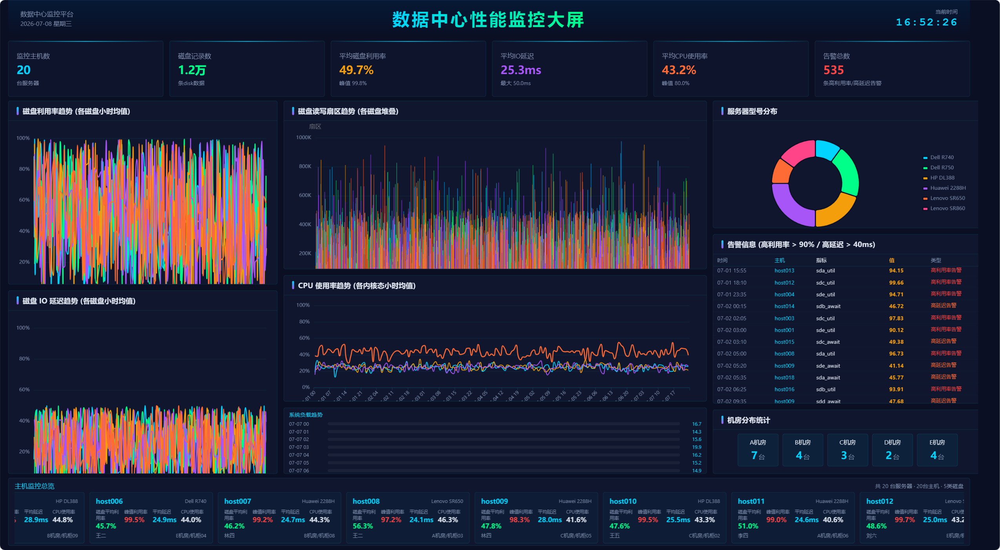

# 数据中心性能监控大屏

基于真实服务器监控数据（disk_tsar / pref_tsar）构建的数据中心性能可视化大屏，展示 20 台服务器的磁盘、CPU、内存、网络、负载等关键指标。

## 数据来源

使用四个 `.dat` 文件中的真实监控数据：

| 文件 | 内容 | 数据量 |
|---|---|---|
| `disk_tsar.dat` | 磁盘性能指标（5块磁盘 × 7项指标/台） | 12,000 条 |
| `pref_tsar.dat` | 系统性能指标（CPU/内存/网络/负载/进程） | 67,200 条 |
| `host_detail.dat` | 20台主机信息（型号/负责人/机房/机柜） | 20 条 |
| `mod_detail.dat` | 监控指标定义说明 | 30 条 |

数据已预处理为 JSON 格式存放在 `public/data/` 目录下，前端直接通过 fetch 加载展示。

## 界面概览



## 大屏布局

| 区域 | 内容 |
|---|---|
| **顶部** | 标题"数据中心性能监控大屏" + 实时时钟 |
| **KPI行** | 6项核心指标卡片：监控主机数、磁盘记录数、平均磁盘利用率、平均IO延迟、平均CPU使用率、告警总数 |
| **左侧** | 磁盘利用率趋势折线图 + IO延迟趋势折线图（sda~sde 五磁盘分色） |
| **中央** | 磁盘读写扇区堆叠柱状图 + CPU使用率趋势图 + 系统负载实时条 |
| **右侧** | 服务器型号环形饼图（Huawei/Dell/HP/Lenovo） + 告警信息滚动表 + 机房分布统计 |
| **底部** | 20台主机横向滚动卡片（每台显示平均/峰值磁盘利用率、延迟、CPU使用率、负责人、位置） |

## 技术栈

- **前端框架**: Vue 3 + TypeScript
- **构建工具**: Vite 5
- **状态管理**: Pinia
- **图表库**: ECharts 5
- **样式**: SCSS (Scoped)
- **自适应**: 基于 1920×1080 设计稿等比缩放

## 使用方法

```bash
# 1. 克隆仓库
git clone git@github.com:Affiche62/Day3_DataScreen.git
cd Day3_DataScreen

# 2. 安装依赖
npm install

# 3. 启动开发服务器
npm run dev
```

浏览器自动打开 `http://localhost:3000` 即可看到大屏。数据文件已预置在 `public/data/` 中，克隆后可直接运行。

### 构建生产版本

```bash
npm run build
npm run preview
```

## 项目结构

```
big-screen/
├── public/data/           # 预处理后的JSON数据文件（已提交）
│   ├── alerts.json        # 告警数据
│   ├── cpu_trend.json     # CPU趋势
│   ├── disk_*_hourly.json # 磁盘指标小时趋势
│   ├── host_summary.json  # 主机汇总
│   ├── hosts.json         # 主机信息
│   ├── kpi_summary.json   # KPI汇总
│   ├── load_trend.json    # 负载趋势
│   ├── location_stats.json # 机房分布
│   ├── mem_trend.json     # 内存趋势
│   ├── model_stats.json   # 型号分布
│   └── net_trend.json     # 网络趋势
├── src/
│   ├── types/dashboard.ts           # 类型定义
│   ├── stores/dashboard.ts          # Pinia状态管理
│   ├── services/api/index.ts        # 数据获取服务
│   ├── hooks/                       # useChart, useScreenScale
│   ├── components/
│   │   ├── common/                  # KpiCard, ChartWrapper, ScrollTable
│   │   └── charts/                  # LineChart, BarChart, PieChart
│   └── views/Dashboard/             # 大屏主页面及面板组件
├── index.html
├── package.json
└── vite.config.ts
```
